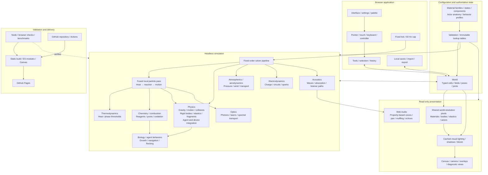

# Sandlab engine boundaries

Sandlab separates configuration, authoritative state, solvers and presentation.
Definitions are plain data; compilation validates and derives lookup tables once.
Solver algorithms implement supported behavior kinds, rather than embedding code
inside each material or allocating an object for every pixel.

[View the project component diagram](docs/architecture.svg).

## Configuration and state

- `sim/material-definitions.js`, `material-states.js` and `material-profiles.js`
  configure base families, states and components; `material-authoring.js` and
  `material-registry.js` compile immutable definitions and numeric lookup tables.
  Known chemical products belong to data, not guesses based on color or names.
- `sim/entity-definitions.js` owns joint geometry, locomotion parameters and
  appearance recipes. `entity-registry.js` validates and freezes profiles;
  `creature-profiles.js` is the compatibility lookup facade. `projectile-profiles.js`
  supplies motion defaults; a material can override them with `projectileMotion`.
- `sim/world.js` owns typed particle state, grid queries and transactional mutation.
  Existing `move`, `transferHeat` and `step` APIs delegate calculations to solvers,
  so tools, saves and old tests retain their entry points.
- A material/actor definition is never the live particle/body. Solvers own scratch
  queues, caches, contact limits and derived values; persistence owns validation
  and stores only authoritative state. Actor anatomy currently has nine joints and
  eight links, and each creature/device population remains bounded.

## Solver ownership and ordering

| Concern                    | Calculation owner                                                                                                  | Shared inputs and outputs                                                            |
| -------------------------- | ------------------------------------------------------------------------------------------------------------------ | ------------------------------------------------------------------------------------ |
| Thermodynamics             | `sim/solvers/thermodynamics.js`, `sim/phase-changes.js`                                                            | Particle/air temperature, conductivity, phase thresholds and heat sources            |
| Electrodynamics            | `sim/solvers/electrodynamics.js`, `sim/circuits.js`, `sim/sparks.js`                                               | Conductivity, oxidation/insulation, charge, gate state and heat                      |
| Atmospherics               | `sim/solvers/atmospherics.js`, `sim/airflow.js`                                                                    | Pressure, face velocity, permeability, moving-matter impulses and vents              |
| Physics / mechanics        | `sim/solvers/physics.js`, `particle-motion.js`, `particle-contacts.js`; rigid, elastic and fragment subsolvers    | Gravity, density, viscosity, momentum and occupied cells                             |
| Chemistry and transport    | `sim/chemistry.js`, `sim/reaction-registry.js`, `sim/mixtures.js`, `sim/absorption.js`, `sim/oxidation.js`         | Compiled contact rules, finite reagents/ingredients, pores, temperature and pressure |
| Combustion and energy      | `sim/combustion.js`, `sim/ignition.js`, `sim/energy.js`, `sim/weather.js`                                          | Fuel, ignition/exposure, lifetime, heat and atmospheric impulses                     |
| Bodies and elastics        | `sim/rigid-bodies.js`, `sim/body-*.js`, `sim/elasticity.js`, `sim/elastic-momentum.js`                             | Continuous poses/joints, mass, contacts, bonds, stress and occupied cells            |
| Biology and agents         | `sim/biology.js`, `sim/microbiology.js`, `sim/stickmen.js`, `sim/creature-*.js`, `sim/boids.js`, `sim/missiles.js` | Compiled behavior/anatomy profiles, paths, habitat, targets and body state           |
| Acoustics                  | `sim/solvers/acoustics.js`, `sim/acoustics.js`, `sim/acoustic-*.js`                                                                            | Bounded events, material barriers, damped wave field and listener sampling           |
| Optics                     | `sim/solvers/optics.js`; read-only visual radiance in `lighting.js`, `light-*.js`                                                                 | Absorption/reflection/refraction, geometric rays, cached radiance and shadows        |

`sim/solvers/physics.js` owns gravity configuration, environment preparation,
particle movement/contact rules, local blast coupling and the scheduled rigid, elastic, agent/device
integration and fragment phases. Its subsolvers retain their own bounded scratch
and algorithms; `World.move`, `canMove`, `tryMove` and `setGravity` are compatibility
facades. Agent decision-making still runs in the existing behavior modules, which
share integration passes with anatomy; this is not a new separate AI scheduler.

`sim/solvers/pipeline.js` advances fields, circuits, local particles, rigid bodies,
elastics, agents, devices, fragments and sound in fixed order. The local pass in
`particle-pass.js` retains heat/contact/reaction/movement order and seeded results.
`reactions.js` dispatches phase, chemistry, combustion, biological and special
handlers; it no longer owns charge propagation or heat-source calculations.

Separation does not require a full grid traversal for every component. Atmospheric
pressure and heat share one face stencil; the thermal kernel owns the heat result.
Particle heat, chemistry and motion share one traversal. This avoids extra array
allocation and passes while keeping each calculation in its appropriate module.

Renderers never advance simulation time. Visual radiance may refresh at its own
bounded cadence from read-only world state; it is separate from mechanical photons
and lasers. Web Audio playback remains outside the acoustic simulation.

## One pixel presentation

All matter, rigid bodies, elastic skins, animated characters and devices enter the
same world-resolution pixel surface. `render/material-pixels.js` computes material
colors and diagnostic views. Rigid pixels use the actual occupied collision cells;
there is no second rotated texture with a different contact silhouette.
`render/elastic-renderer.js` rasterizes connected links/faces into that same image,
protecting pixels occupied by other materials. Segments have a 64-cell limit and
faces a 256-pixel budget; a cut edge cannot leave a painted bridge.

Actors and devices rasterize anatomy/sprite recipes at world resolution, then the
entire scene scales once without interpolation. `renderer.js` owns the camera,
composition and overlays. Render modules live in `src/render`, not the headless
simulation. Inspection, export thumbnails and resize previews use the same pixels.

Continuous rigid poses and spring/actor joints remain physics state. Presentation
quantizes them to the material pixel scale: rotation and animation have pixel steps,
but forces and tension retain fractional precision. Elastic skins between nodes are
visual coverage, not extra material or duplicated mass; occupied cells remain the
contact/chemistry authority. Full subpixel fluid particles would require a different
neighbor/contact solver and substantially more state; the pixel approach preserves
the current game and its inexpensive grid queries.

## Viewport ownership

`viewport-navigation.js` switches the fixed-size live `World` between physical origins and pitches; `renderer.js` delegates pan/pinch/wheel navigation and keeps presentation pixels fixed. `sim/viewport-resample.js` owns bounded material reduction, refinement, structural reconnection, field interpolation and fast typed-row panning. Solvers continue to operate on only one grid.

`sim/viewport-cache.js` stores sparse unresolved detail with an explicit LRU byte budget; `viewport-overview.js` retains a fixed coarse reconstruction source, not a live world. `hidden-entities.js` predicts finite poses against coarse obstacles and destructive-event history. `world-units.js` defines distance/area units, and `mechanical-mass.js` combines density, fractional quantity and contents. `persistence.js` includes world rules, physical origin and the compressed overview but excludes ephemeral detail references/cache. See `PHYSICS_MODEL.md` for the deliberate fidelity losses.

`setting-controls.js` supplies shared form widgets; `world-rules-panel.js` edits a world-local draft committed by `level-editor.js`. Browser preferences contain presentation/input/cache limits, not simulation rules.

## Extension and verification

Add ordinary materials through traits/state data; add actor species through the
existing anatomy and movement profiles; change missile parameters through
`projectileMotion`. A new fundamental mechanism or behavior kind requires a shared,
bounded solver, not a function stored inside a material definition. This release
establishes ownership boundaries; it does not add a runtime material editor, new
thermal units, a Maxwell solver or a continuum fluid model. See
[PHYSICS_MODEL.md](PHYSICS_MODEL.md) for the supported approximations.

`engine-boundaries.test.js` checks data purity, profile validation, headless imports,
relative module paths, elastic occlusion and non-mutating rendering. The extracted
solvers were also compared against v1.26.1 for identical 120-tick saved state in
Sandbox, looping borders, Planet and Whirlpool, including reactions, bodies and
entities. `unified_scene_check.py` checks occupied/visible solid agreement, cuts,
colors, shared actor resolution and read-only draw/export on desktop and touch.

Controlled full scene draws with lighting/bloom disabled, 16,000 cells, 20 warmups
and 70 samples on the development host: Steel 3.22 → 1.38 ms mean; Rubber
26.33 → 9.65 ms mean. These measure the new shared renderer against v1.26.1;
they do not estimate physical-phone FPS. `npm run bench:render -- <checkout>` can
repeat the fixture with another checkout.

The v1.28.1 solver extraction was compared with v1.28.0 for identical 120-tick
particle/body saves and acoustic buffers/events across Sandbox, looping/void
borders, horizontal/inverted gravity, Planet, Whirlpool, Zero Gravity and Day And
Night. Ownership tests prevent collision rules from returning to World or direct
mechanical stage advancement from returning to the pipeline.
